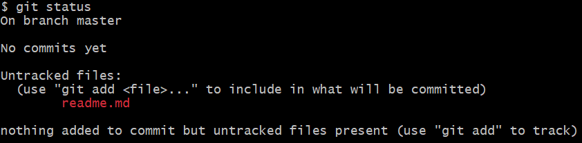
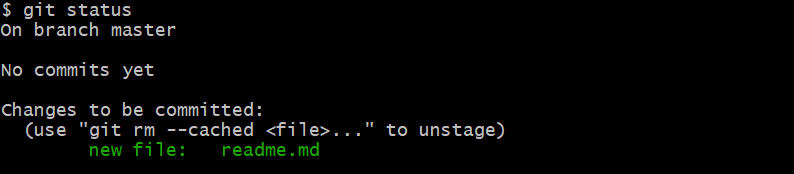
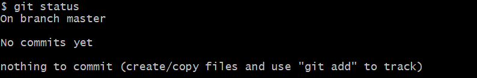

Languages: [Portuguese](readme-br.md) | [English](readme.md)

# 📚 Main Commands in GIT
This repository was created to simply and review the main commands used in GIT and what each of them is for!

## ✨ Initializing a repository

After installing GIT and configuration your credentials, open Git Bash by right-clicking on your project folder and type the command below:

```
git init
```

## ✔️ Connecting with remote repository

To connect your local repository with the remote one:
```
git remote add origin https://github.com/username/repository.git
```
<i>This link is just a example, replace with yours.</i>

## ⚡ Cloning a remote repository

If you already have a remote repository, you can just clone this into your folder:
```
git clone https://github.com/username/repository.git
```

## ➕ Adding files in your commit

Before do a commit, you need add your new and change files to the staging area.

Adding just one file:
```
git add file_name
```
Adding a file that is in another folder:
```
git add folder/file_name
```
Adding all the files and changes:
```
git add .
```

## ➖ Removing a file in the stating area

To remove a file in the staging area (this not undo your changes in your real files project):

```
git restore -- staged file_name
```
If you want remove all them:
```
git restore -- staged .
```

## 🔍 Checking status in the staging area

To check which files is already in the staging and which is not in:
```
git status
```

What's in red is the files which is not in the staging area yet:



What's in green is the files which is in the staging area:



And if you don't have any files to add in the staging area:



## 📦 Doing a commit

To do a commit, which will prepare all the files in the staging area to be push late:

```
git commit -m "your message here"
```

<i>Be careful when writing a message, be sure that you are explain what the commit is for.</i>

## 🚀 Doing a push

To do a push to your remote repository:
```
git push -u origin nome_branch
```
## 🔍 Checking your commit history

To check all commits that you did:

```
git log
```

## 📝 Updating your last commit message

To update the last commit:

```
git commit --amend -m "your new message here"
```
## ↩️ Undoing a commit in the HEAD

To undo the last commit that was did without undo the changes in the staging area, just in the HEAD (which always point in the last commit):

```
git reset --soft
```

## ↩️ Undoing a commit in the HEAD and in the staging area

To undo the last commit in the HEAD (which always point in the last commit) and the staging area:

```
git reset --mixed
```
## ↩️❗ Undoing a commit in the HEAD, in the staging area and in your project

To undo the last commit in the HEAD (which always point in the last commit) and the staging area <b>AND IN YOUR PROJECT:</b>

```
git reset --hard
```

## ⬇️ Updating your project by pull

In case you and another person is working in the same project and you want get the changes that was did and update in your local repository:

```
git pull
```

## ➕ Creating a new branch

To create a new branch:
```
git checkout -b branch_name
```
## 🔨 Swapping branches

To swap to another branch already created:
```
git checkout branch_name
```
## 🔍 Checking the last commit in each branch

To check the last commit in each branch already created:

```
git branch -v
```

## ❌ Deleting a branch

To delete a branch:

```
git branch -d branch_name
```

## 🔀 Merging between two branches

Before do a merge, check if you are in the branch that will receive the update. After that, type the command below:
```
<<<<<<< HEAD
git merge origin_branch
```
=======
git merge branch_origem
```
>>>>>>> 8ab38458c80061712238331f01353fcaf142e85e
